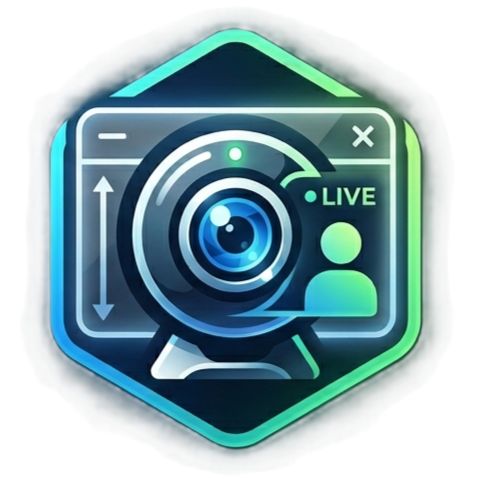

<p align="center">
  
</p>

<h1 align="center">Camera-on-Screen</h1>

<p align="center">
  I made this because I'm too lazy to do any post editing.
</p>

<p align="center">
  <a href="https://github.com/officialdad/camera-on-screen/actions/workflows/ci-linux.yml"></a>
  <a href="https://github.com/officialdad/camera-on-screen/actions/workflows/ci.yml"></a>
</p>

---

An always-on-top webcam overlay for **Linux and Windows**. It floats your live
camera feed over everything else, so any screen recorder or screen sharing session
captures you and your screen together in real-time. Useful for teaching too.

Included NVIDIA powered features such as
- **AI Green Screen** (background removal)
- **AI Eye Contact** (gaze redirection)
- **AI Interpolation** (doubles webcam FPS — Windows only for now)

> **You need:** an **NVIDIA RTX GPU** for the AI effects, on Linux (X11/XWayland)
> or Windows. On other hardware the overlay still works without the AI effects.

## Install

### Linux (current release focus)

1. Download the latest `CameraOnScreen-<ver>-linux-x64.tar.zst` from
   [**Releases**](https://github.com/officialdad/camera-on-screen/releases).
2. Extract and run — it is self-contained (bundled .NET runtime **and** the
   NVIDIA Maxine runtime; no env vars, no extra downloads):

   ```bash
   mkdir camera-on-screen && tar -C camera-on-screen --zstd -xf CameraOnScreen-<ver>-linux-x64.tar.zst
   camera-on-screen/CameraOnScreen.App.Avalonia
   ```

Preferences are kept at `$XDG_CONFIG_HOME/CameraOnScreen/config.json`
(`~/.config/CameraOnScreen/config.json`).

### Windows

Installer releases are paused until Windows CI returns
([#38](https://github.com/officialdad/camera-on-screen/issues/38)) — the latest
Windows installer is
[**v0.7.0**](https://github.com/officialdad/camera-on-screen/releases/tag/v0.7.0)
(`CameraOnScreen-Setup-0.7.0-x64.exe`). It installs **per-user** (no admin) and
bundles everything it needs. Windows SmartScreen will warn (unsigned): click
**More info → Run anyway**. Uninstall from **Settings → Apps**; preferences are
kept at `%LOCALAPPDATA%\CameraOnScreen\config.json`.

> The AI effects ship with models for **RTX 20/30/40-series and Blackwell**
> GPUs, but are only verified on **RTX 30-series & 20-series** so far - other RTX
> architectures load best-effort. On non-RTX hardware the app still installs and
> runs as a plain webcam overlay.

## Using it

- **Move it** - drag the centre **+** handle (Windows) or drag anywhere (Linux).
- **Hand grab** (Windows) — make a fist ✊ at the camera to grab the overlay, move your hand to drag it, open your hand to drop it. Point ☝ freely — pointing never moves the overlay. Runs on-device (CPU, MediaPipe hand models); works on any GPU.
- **Resize it** - scroll the mouse wheel over the overlay.
- **Mirror / zoom** - toggle in the control panel.
- **AI Green Screen** - removes your background with adjustable edge expand /
  feather.
- **AI Eye Contact** - gently redirects your gaze toward the camera.

Then record with NVIDIA ShadowPlay, Game Bar or stream live with the overlay
always visible on real time in the capture.

## Contributing

Issues and pull requests are welcome. See [CONTRIBUTING.md](CONTRIBUTING.md) for
how to build, the RTX/Maxine requirements, and the bar PRs need to clear.

## License

[MIT](LICENSE). The bundled NVIDIA Maxine runtime is governed separately under
the NVIDIA Maxine SDK License - see
[`THIRD-PARTY-NOTICES.md`](THIRD-PARTY-NOTICES.md). NVIDIA, Maxine, and RTX are
trademarks of NVIDIA Corporation; this project is not affiliated with NVIDIA.

---

# Technical details

## What it is

- A **C# .NET 8** control panel — **Avalonia** on Linux, **WinUI 3** on Windows —
  sharing one cross-platform `Core` (view models, orchestration).
- A native **C++ C-ABI shim** (P/Invoke) doing the camera capture (**V4L2** on
  Linux, **Media Foundation** on Windows) and the optional Maxine effects.
- The C# side owns all windowing/compositing (a transparent topmost X11 window on
  Linux; a layered DirectComposition overlay on Windows); the shim only captures
  and applies effects.

## NVIDIA Maxine SDKs

The AI effects use the **NVIDIA Maxine Video Effects SDK** (green screen) and
**NVIDIA Maxine AR SDK** (eye contact). These are **not bundled** in the
repository - download them from <https://developer.nvidia.com/maxine> and point
the build at them. See [`THIRD-PARTY-NOTICES.md`](THIRD-PARTY-NOTICES.md).

The two SDKs each pin an exact CUDA + TensorRT runtime and **cannot mix** in one
process. Use a co-versioned pair - verified: **VFX 1.2.0.0 + AR 1.1.1.0** (shared
TensorRT 10.9 / CUDA 12.x).

## NVIDIA Optical Flow SDK

AI Interpolation uses the **NVIDIA Optical Flow SDK** (`NvOFFRUC.dll`) to synthesize
a temporal mid-frame between each real camera frame, doubling the overlay frame rate
from 30 to 60 fps. This is a **separate product** from Maxine, governed by the
**NVIDIA DesignWorks SDK License** - not bundled in the repository, point the build
at it via `COS_FRUC_SDK_DIR`. See [`THIRD-PARTY-NOTICES.md`](THIRD-PARTY-NOTICES.md).

FRUC uses CUDA 11 (`cudart64_110.dll`) - a distinct runtime from Maxine's CUDA 12 -
so both stacks coexist in one process without conflict. Verified on RTX 3090.
Requires driver ≥ 528.24; the CUDA 11 runtime is bundled (no separate install).

## Build

### Linux

Prerequisites: .NET 8 SDK, CMake, g++. The shim builds with CI-safe passthrough
stubs unless the Maxine Linux SDK-core trees are supplied at cmake time (see
[`CLAUDE.md`](CLAUDE.md) for the SDK env vars and the runtime/bundle details).

```bash
cmake -S native/shim -B native/shim/build && cmake --build native/shim/build
dotnet run --project src/CameraOnScreen.App.Avalonia   # X11/XWayland
scripts/publish-linux.sh --tar   # self-contained dist/linux + release tarball
```

### Windows

Prerequisites: .NET 8 SDK, VS2022 Build Tools + MSVC v143. The native shim must
be built **before** the App.

```powershell
# 1. Native shim (PowerShell - Bash mangles MSBuild /p: switches).
$env:COS_VFX_SDK_DIR  = "<path-to-VideoFX-SDK>"
$env:COS_AR_SDK_DIR   = "<path-to-Maxine-AR-SDK-clone>"
$env:COS_FRUC_SDK_DIR = "<path-to-Optical-Flow-SDK>"   # optional; omit for passthrough stub
& "C:/Program Files (x86)/Microsoft Visual Studio/2022/BuildTools/MSBuild/Current/Bin/MSBuild.exe" `
  native/shim/shim.vcxproj /p:Configuration=Release /p:Platform=x64

# 2. App (copies the shim next to the exe).
dotnet build src/CameraOnScreen.App/CameraOnScreen.App.csproj -t:Rebuild

# 3. Core unit tests.
dotnet test tests/CameraOnScreen.Core.Tests/CameraOnScreen.Core.Tests.csproj
```

Without the SDK env vars the shim builds a CI-safe **passthrough stub** (effects
disabled) so the project still builds on machines without the SDK. For the
runtime env vars needed to actually run the effects, see
[`CLAUDE.md`](CLAUDE.md).

## CI / Release

Every PR is gated by GitHub Actions, warnings treated as errors:

- **Hosted Linux job** — stub shim build, ABI smoke, Avalonia app build, Core
  unit tests.
- **Self-hosted Linux RTX runner** — full co-versioned Maxine shim build, a
  stale-stub deploy check, and a real GPU capability probe (both effects load).
- **Hosted Windows job** — stub compile of the shim + WinUI app (full Windows
  CI parked until a Windows RTX runner exists again,
  [#38](https://github.com/officialdad/camera-on-screen/issues/38)).

A `v*` tag builds, GPU-verifies, and publishes the **Linux tarball** as a GitHub
release on the RTX runner; Windows installer releases are manual and currently
paused (#38). See
[`docs/ci/self-hosted-runner.md`](docs/ci/self-hosted-runner.md).
